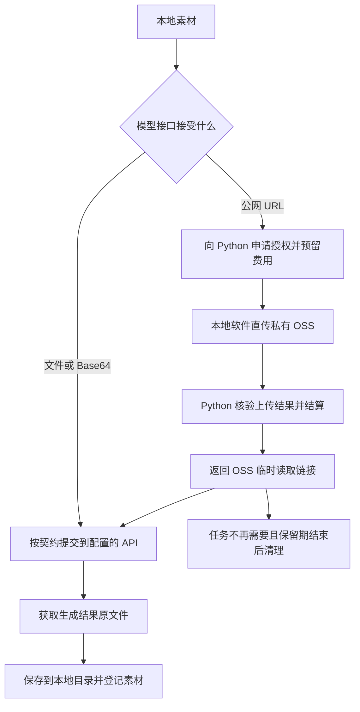

# Web 端与本地端产品及素材传输方案

状态：讨论稿。记录已明确的产品方向与建议，不代表已实现；本次只编写文档，不开发转换服务、不修改部署或收费配置。

## 1. 产品方向

保留当前 Web 产品，同时规划本地产品。两端尽量复用画布、模型请求和媒体处理能力，按运行方式决定数据保存位置。

| 项目 | Web 端 | 本地端 |
| --- | --- | --- |
| 使用入口 | 当前网站 | 用户电脑中的本地应用，具体打包方式待选 |
| 数据主存储 | 延续当前账号与云端能力；已有本地行为不因本方案擅自取消 | 画布、素材文件、历史和配置以本地持久化为准 |
| 长期 OSS | 延续当前策略 | 默认关闭，用户无需配置 OSS；临时上传由平台私有 OSS 承载 |
| 可选云存储 | 当前云端存储能力 | 单独收费，用户开通后主动使用 |
| 登录 | 延续当前账号机制 | 无需登录应用或平台账号 |
| 服务 Key | 延续当前策略 | 用户只填写临时素材上传 Key 和 NewAPI Key，两者独立 |
| 服务地址 | 延续当前渠道配置 | 临时素材服务地址和 NewAPI 地址由运营者预先配置并打包，普通用户不填写地址 |
| 公网素材 | 可以使用云端素材链接 | 仅当模型契约需要公网链接时上传临时副本 |

NewAPI Key 必须由预置 NewAPI 网关认可；上传 Key 必须由预置临时素材服务认可。不同供应商原生 Key 不一定能填进同一个网关地址使用，不能承诺任意 Key 通用。

### 本地端首次使用

用户打开应用即可编辑和保存本地内容，不进入登录流程。服务设置只提供两个凭据输入项：

1. 临时素材上传 Key：用于上传临时副本及查询对应服务额度。
2. NewAPI Key：用于模型调用和对应任务查询。

两个服务地址随安装包预置，安装包不包含用户 Key 或运营者共用密钥。两项 Key 分别保存、分别校验；未填写或失效只影响依赖该服务的在线操作，不阻止本地画布打开。需要临时 URL 的生成流程先完成上传校验与上传，再提交模型任务，避免上传失败后才发现已发起生成。

免登录不等于没有用户账户：Python 平台有用户和管理员，上传 Key 关联用户余额和权限。本地软件通过 Key 调用，不要求另行登录；用户在平台网站管理账户和凭据，NewAPI Key 仍由 NewAPI 管理。充值渠道和凭据发放细节另定。

## 2. 本地保存的边界

本地端默认不执行长期云归档和账号业务数据同步，不自动将完整画布、聊天历史或素材库上传到平台。具体模型调用仍会发送用户选择的提示词和参考素材。

生成结果应下载原文件到本地并登记本地素材，不能只保存一个会过期的上游 URL。保存失败要显示错误并允许重试；程序关闭后不能假设归档继续运行，重新打开时恢复可查询任务。

本地原文件建议使用应用管理的文件目录，元数据使用本地数据库；不把浏览器缓存作为素材唯一的长期保存位置。需要支持备份、恢复、修改数据目录与文件缺失提示，具体实现按第一版本范围取舍。

Key 建议由本地后端管理，并使用操作系统凭据存储等成熟能力保护，不进入普通日志、画布导出或素材分享数据。固定 API 地址是产品配置策略，不能被视为用户无法绕过的安全边界。

“所有数据保存在本地”的准确表述为：业务数据和素材原件默认保存在本机；使用在线模型时，必要的请求内容会发往配置的 API；模型要求 URL 输入时，会额外上传选定素材的临时副本。上游与网关的日志和保留行为不由本地保存策略保证。

## 3. 公网链接不是单纯的格式转换

本地文件路径、`localhost` 地址和浏览器 Blob URL 不能供远端模型直接读取。把本地视频或图片变成可访问的公网 URL，需要一个远端可访问的服务实际接收或托管文件。

这里应区分三种能力：

| 能力 | 实际动作 | 是否必须托管公网文件 |
| --- | --- | --- |
| 请求格式适配 | 转换字段、JSON、multipart、Base64 等 | 不一定 |
| 临时素材托管 | 接收文件，提供模型可以读取的 URL | 是 |
| 媒体转码 | 改编码、尺寸、格式等 | 取决于处理位置；不是生成 URL 的必要步骤 |

当前需求主要是第二种，名称建议为“临时素材服务”。不应为了拿到链接而默认压缩或转码，避免改变原文件和额外成本。

## 4. 素材提交策略

先依据实际接口契约选择传输方式，不统一强制转为 URL。

1. 接口接受文件或 Base64：本地端直接按契约向配置的 API 提交。
2. 素材已有可用且授权访问的公网地址：尽量复用，检查有效期是否覆盖模型处理窗口。
3. 接口仅接受公网 URL、素材只有本地副本：临时上传选定文件，获得短期链接，再提交模型请求。
4. 临时服务不可用：明确提示，不悄悄启用付费长期 OSS，不返回模型无法访问的本地地址。

对模型可读的签名链接，不要求额外携带本地登录态或私有请求头。有效期必须覆盖排队和拉取，不应在提交成功后立即删除；临时副本与本地原件分别管理。

## 5. Python 鉴权计费平台与私有 OSS 直传（已确定）

已单独提取为[Python 临时素材平台开发需求](../../../temporary-media-platform-requirements.md)，可独立交给新项目。平台开发以该文档为入口；本文保留双端接入背景和已确定的架构说明。

### 网站与接口的职责

需要另外开发并部署 Python 平台网站，提供用户、管理员、Key 鉴权、余额、价格、账单和上传授权能力。临时文件实际保存在运营者的私有 OSS 中；Python 服务器处理小体积控制请求和元数据，不接收或转发正常上传、下载的文件正文。

本地软件用上传 Key 向预置 Python 地址申请授权，然后直接向 OSS 上传文件。Python 核验成功并完成结算后，软件取得模型可读的临时签名 URL。无需在本地软件里填写 Bucket、OSS AccessKey 或登录平台网站。

| 服务 | 部署与职责 | 本地端接入方式 |
| --- | --- | --- |
| 现有画布 Web 网站 | 当前在线画布及账号业务 | 延续现有 Web 方式 |
| Python 平台网站 | 管理用户、价格、余额、Key、上传授权、核验、签名和清理 | 预置平台 API 地址＋上传 Key |
| 平台私有 OSS | 接收客户端直传，保存临时副本，向模型提供文件正文 | 平台签发的短期上传凭证与读取 URL |
| NewAPI 网关 | 模型调用、路由及供应商协议适配 | 预置 NewAPI 地址＋NewAPI Key |

独立服务入口不意味着必须购买另一台服务器，可以按部署条件共用机器；但临时素材 API 的鉴权和生命周期要独立，不要求本地用户登录画布 Web 网站。

### 管理员与用户

- 管理员：管理用户、禁用或撤销 Key、配置价格和限额、调整余额、查看账单和异常上传、配置私有 OSS 及清理策略。余额调整需保留操作记录。
- 用户：查看余额、价格、用量和扣费记录，管理自己的上传 Key；充值入口与支付方式待定。
- 平台网页管理使用相应账户鉴权；本地调用使用上传 Key，两者不可与“本地软件必须登录”混淆。

### 上传、核验与扣费

1. 客户端提交文件类型、大小等元数据和幂等请求标识，Python 验证 Key、限额及余额，预留费用。
2. 平台创建上传单和专属对象路径，签发限定对象、操作和有效期的上传凭证；根据所选 OSS 能力限制大小、类型，不能授予列桶、任意覆盖或删除权限。
3. 客户端直传私有 OSS，永久 OSS 密钥只保存在服务端。上传凭证不是素材读取地址。
4. 客户端通知完成或 OSS 发出可验证回调，Python 核验对象归属、路径、大小和存储服务支持的校验信息；不能仅凭客户端声称成功结算。
5. 核验通过后，按上传单锁定的价格规则结算，返回素材标识、到期时间和短期读取 URL。只有就绪且已完成结算的对象可取得读取链接。
6. 失败、取消或超时的上传单释放预留费用，并清理孤立对象或未完成分片。重复申请、完成通知和回调须幂等，不重复扣费。

预留、结算和释放应以持久化账本及原子状态更新实现；成功结算但响应丢失时，客户端查询同一上传单即可恢复结果。仅在 Python 请求期间保存在内存中不足以保证不重扣。

以上采用“上传成功核验后结算”的基础流程。若价格包含后续读取流量或存储时长，还需基于 OSS 可核对的用量另行结算，不能将上传完成时的费用称为最终全部成本。模型生成失败不等于素材上传失败，退款规则需单独公示。

### 最小 API 契约草案

以下是待实现的接口建议，不是现有可调用地址：

| 接口能力 | 请求 | 返回或行为 |
| --- | --- | --- |
| 申请上传 | 上传 Key、文件元数据、幂等标识；不提交文件正文 | 上传单 ID、受限 OSS 上传地址/凭证、凭证到期时间、预留金额 |
| 确认上传 | 上传 Key、上传单 ID；或验证 OSS 回调 | 核验并结算，返回 `assetId`、读取 `url`、`expiresAt`、`bytes`、`mimeType` |
| 查询上传单 | 上传 Key、上传单 ID | 上传/结算状态、失败原因、已完成的素材结果 |
| 查询凭据状态、余额与用量 | 上传 Key 鉴权 | 凭据状态、可用/冻结余额、账单及上传限制 |
| 读取临时文件 | 直接 GET OSS 短期签名 URL，无须登录或上传 Key | OSS 返回原文件正文、正确类型；视频按需要支持 Range |
| 自动过期清理 | 服务端后台任务 | 清理已满足回收条件的临时副本，保留本地原件 |

安装包只预置 Python API 根地址，OSS 上传目标与读取地址由平台返回。私有桶不公开，读取采用有期限的签名 URL；长期上传 Key 不拼进 URL。签名过期与对象删除是两件事，文件到期后还需清理实际对象；已经签发的读取期限不得超过对应文件保留期限。

文件尚未就绪时不能返回成功，错误区分 Key 无效、余额不足、额度超限、文件不支持、过大和服务故障。OSS 直传需要配置对应的访问策略；使用浏览器传输时还需满足 CORS。正常链路验证文件正文不经过 Python，但 OSS 自身仍产生存储、请求和流量费用。

### 与 NewAPI 的边界

NewAPI 接收模型请求中的临时链接，供应商或网关按实际协议读取文件；它不替代本方案已确定的临时素材服务网站。“能转发 JSON/multipart”不等于“能提供公网文件托管”，不依赖未经验证的 NewAPI 转换能力。

本地项目的接口契约已区分标准文件输入和 Canvas v1 URL/Data URL 媒体输入，见 [NewAPI 接口文档](newapi-interface-contract.md)。最终还要核对目标网关版本、插件和具体模型，不在本文承诺未经验证的能力。

### 基本能力与边界

独立服务负责上传、短期链接、额度、过期清理；NewAPI 继续负责模型鉴权、路由和协议适配，职责容易区分。它可以被 Web 与本地端共用。

独立平台采用 Python 已确定，具体框架、数据库及代码仓库位置在实现计划中选择，不再将 Go 列为本平台的并行候选方案。

网站服务的最小范围包括：

- 使用临时素材上传 Key 鉴权，校验类型、大小和该凭据对应的额度，无须平台登录会话。
- 返回素材标识、短期访问 URL、到期时间；重复请求可安全重试。
- 模型能够读取完整文件，视频按实际需求支持 Range。
- 后台清理过期副本，失败可追踪重试；不能误删仍需模型拉取的文件。
- 在同一上传授权主体、有效期内复用已有临时上传，先不做跨授权主体秒传；不能要求额外登录才能识别归属。

临时服务只接收上传 Key，不接收 NewAPI Key；NewAPI 请求只携带 NewAPI Key，不携带上传 Key。提供给模型的短期文件 URL 使用独立的受限访问凭证，不把长期上传 Key 拼入 URL。模型读取临时文件无需登录应用，也无需获得上传 Key。

## 6. 临时托管与付费 OSS 分开

| 项目 | 临时素材服务 | 付费 OSS |
| --- | --- | --- |
| 目的 | 满足模型 URL 输入要求 | 长期云保存、分享及后续可能的跨设备能力 |
| 生命周期 | 有期限，任务不再需要后清理 | 按套餐及素材引用策略管理 |
| 本地原件 | 保留 | 保留；是否允许主动迁移另定 |
| 默认行为 | 仅必要时上传选定素材 | 默认关闭，开通后由用户选择使用 |
| 成本 | 仍有临时存储和流量成本 | 长期容量和下载流量成本 |

“本地端关闭 OSS”指关闭用户长期云存储功能、无需用户配置 OSS，不是临时平台不用 OSS。临时文件明确保存在平台私有 OSS 中；用户本机仍保留原件。平台永久 OSS 凭据不下发，客户端只取得操作受限的短期凭证。

临时上传是带余额扣费的服务，价格由管理员配置，用户通过上传 Key 对应账户支付；是否赠送免费额度、具体计费单位和价格尚未确定。临时上传费用与可选长期云存储套餐分开，不强制用户购买长期存储才能获取临时链接。

## 7. 与素材 ID 和回收方案的关系

配套文档：[素材去重、ID 引用与存储回收方案](media-lifecycle-design.md)。

- 本机素材 ID 可用于本地不同画布引用和去重；远端用户拿到 ID 并不能读取本机文件。
- 跨账号长期引用需要持久可访问的云端文件和引用登记，属于云端能力，不能依赖短期链接保证永久可用。
- 临时上传 ID 不直接成为可长期分享的素材 ID，不自动加入公共素材库。
- 本地文件回收由本地后端根据本机持久引用和撤销记录判断；云端共享文件由云端服务统一判断。
- 本地版本不得依据本机零引用删除多个客户端共用的云对象。
- 本机与云端的存储范围分开去重，不把用户是否购买 OSS 与内容哈希判断混为一谈。

## 8. 当前项目需要适配的地方

以下是规划范围，需进一步核查后落到具体代码：

1. 分离 Web 与本地运行配置，避免本地端继承“必须配置全局 OSS”和云登录前置条件。
2. 为素材保存提供明确的本地目标；本地生成结果归档写本机，不进入现有强制 OSS 视频归档路径。
3. 保留现有原视频 URL 读取能力，根据运行方式保存到本地或云端；无直链时仍按协议走受保护内容接口。
4. 实现免登录的双 Key 设置与分别校验，两个服务地址作为运营者构建配置打包；避免复用要求平台登录令牌的云端 API 调用链。
5. 开发 Python 管理与计费平台、私有 OSS 直传授权和核验 API，再按模型契约接入本地端，而非将文件传给 Python 中转。
6. 为付费云服务增加独立的服务端权益与额度校验，不能只隐藏客户端按钮。
7. 验证桌面启动、关闭、重启恢复、文件目录和备份；具体桌面外壳及安装器以后再选。

实现沿用[定制开发规则](rules.md)，尽量共用业务逻辑，通过存储目标和运行配置区分两端，不维护两份长期分叉的画布代码。

## 9. 建议的推进顺序

1. 按已确定的“免登录、双地址预置、双 Key 输入”规则设计本地配置，进一步确定凭据发放和付费 OSS 与临时上传的收费边界。
2. 核查并跑通“不配置用户长期 OSS、本地文件持久化、用户 Key 调用模型、结果保存本地”的最小完整流程。
3. 实现 Python 用户/管理员、Key、价格、余额账本，以及私有 OSS 上传授权、核验、结算和清理。
4. 部署公网 HTTPS 入口，验证“申请并预留→本地直传 OSS→核验结算→返回读取链接→模型读取→结果保存本地”的完整链路。
5. 再接入可选长期云存储权益、桌面打包与跨端分享。

## 10. 验收标准

- 未配置 OSS 时，本地端可以启动、编辑保存画布、管理本地素材；重启后文件仍存在。
- 不登录即可进入本地应用；服务设置只需填写两项 Key，不要求用户填写地址。
- NewAPI Key 只发往预置 NewAPI 服务，上传 Key 只发往预置临时素材服务；两者不进入导出文件、普通日志或模型可读的临时 URL。
- 两项 Key 分别校验和显示错误；任一服务失效不阻断本地编辑，缺少上传 Key 不阻断不需要临时上传的模型请求。
- 接口支持文件输入时，不额外经过临时托管；仅 URL 输入时，远端模型确实可读取上传副本。
- 本地软件用上传 Key 向 Python 申请受限凭证，文件直传私有 OSS；模型通过签名 URL 从 OSS 读取，网络验证文件正文不经过 Python。
- 私有桶匿名读取失败，合法短期 URL 可读取；过期、越权路径及非授权操作被拒绝，永久 OSS 密钥不进入安装包或客户端响应。
- 余额不足不签发上传授权；成功上传仅结算一次，失败或超时释放预留费用；重复回调、响应丢失、重试和服务重启不重扣、不漏记账。
- 管理员可配置价格、管理用户与 Key、核对账本；用户只能查看和操作自己的余额、Key 及上传单。
- 生成原文件保存本机，不强制云归档；离线可打开已保存的画布与素材，在线模型调用离线时明确不可用。
- 临时副本到期清理不删除本地原件，不影响已下载的生成结果。
- 未开通付费 OSS 时无长期云上传；开通与停用后的数据处理和计费规则清楚。
- 网络中断、程序退出、链接过期和磁盘不足时不假装保存成功，恢复与重试不会重复计费提交任务。

## 11. 下一轮需要确认

1. 上传 Key 的领取、充值、撤销和额度查询如何提供？NewAPI Key 沿用目标网关的发放方式。
2. 临时上传的免费额度、容量、文件大小和保留期如何限制？
3. 付费 OSS 是按容量、流量还是套餐收费？如何接入免登录模式，停用后保留与导出规则是什么？
4. 预置服务地址未来变化时，采用稳定域名还是通过新版安装包更新？首版不增加用户手填地址入口。

已确定：Python 平台负责鉴权和计费，客户端直传平台私有 OSS，OSS 提供临时读取 URL。本地端免登录、双 Key 输入、双服务地址预置，长期云存储默认关闭。
