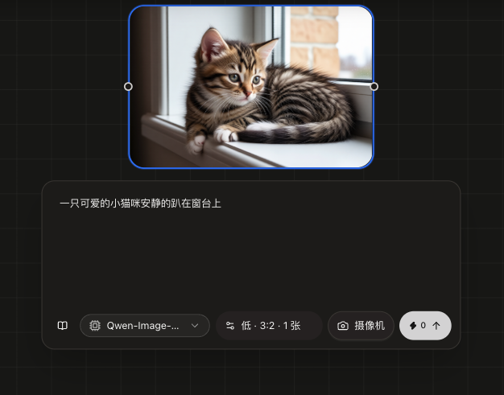
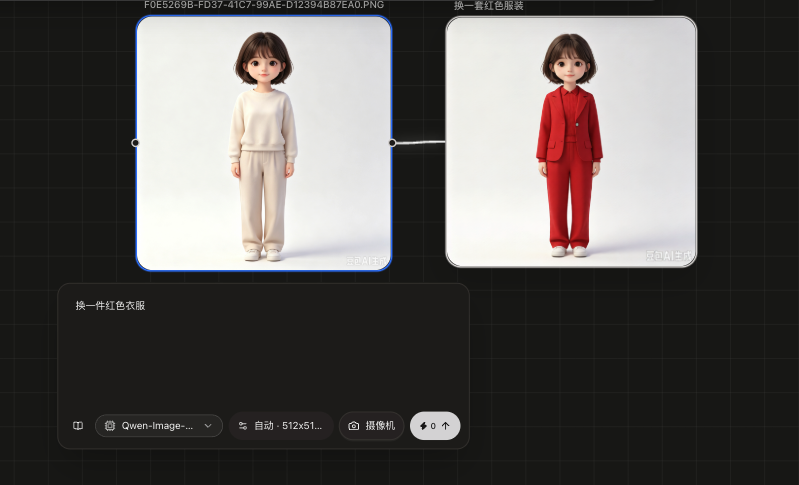

# 接入本地 ComfyUI

本功能允许把本地 / 局域网自建的 ComfyUI 作为生图渠道，在无限画布中直接使用它的模型和自定义工作流，支持**文生图**与**图生图**。

## 效果示例

文生图（本地 ComfyUI + Qwen 模型）：



图生图（本地 ComfyUI + Boogu 模型，参考图换装）：



## 一、接入本地 ComfyUI

1. 确保 ComfyUI 已启动且**局域网可访问**（默认端口 8188），并建议关闭其用户认证或提前准备好访问方式。
2. 打开管理后台「设置 → 渠道配置」，新增渠道：
   - **协议**：选择 `ComfyUI`
   - **接口地址**：填写 ComfyUI 服务地址，例如 `http://192.168.1.100:8188`（不需要 `/prompt` 等路径）
   - **API Key**：ComfyUI 默认无需认证，**可以留空**
   - **拉取模型列表**：点击后自动从 ComfyUI 读取实际可用的模型（包含 checkpoint、unet、clip、vae 四类，覆盖 Qwen、FLUX、SD、Boogu 等常见模型）
   - **渠道可用模型**：从拉取结果中选择要开放给画布的模型
3. 保存渠道后，在画布 / 生图工作台的 AI 设置中选择该渠道的模型即可生成。

> 提示：模型名就是你在「渠道可用模型」中选的名字（通常为 ComfyUI 中的模型文件名）。画布选择该模型后，请求会自动路由到对应的 ComfyUI 渠道。

## 二、导入工作流模板

ComfyUI 的生成逻辑由 **workflow（节点图）** 决定，不同模型/插件的工作流结构差异很大，因此使用前需要把你的工作流导入到渠道配置中。

### 从 ComfyUI 导出（必须是 API Workflow）

ComfyUI 导出有两种格式，**必须使用 API Workflow**：

| 导出方式 | 格式 | 能否使用 |
|----------|------|----------|
| **设置 → 开启 Developer Mode → 工作流菜单 → Save (API Format)** | 纯节点图（每个节点是 `class_type` + `inputs`） | ✅ **必须用这个** |
| 普通的 保存工作流 / Save（Workflow） | UI 格式（含节点坐标、布局、`nodes`/`links` 结构） | ❌ 不可用 |

> ⚠️ **常见误区**：在 ComfyUI 里「保存工作流」导出的 `.json` 是**前端 UI 格式**，无法直接用于 API 调用，上传到本系统会提示「JSON 格式无效」。请务必使用 **Developer Mode 下的 Save (API Format)** 导出的文件。
>
> 判断方法：打开导出的 `.json`，如果内容是类似 `{"nodes": [...], "links": [...]}` 就是普通 workflow（错误）；如果内容是 `{"节点ID": {"class_type": "...", "inputs": {...}}}` 这样的纯节点对象，才是 API workflow（正确）。

### 导入到渠道

在管理后台该 ComfyUI 渠道的编辑表单中：

- **文生图 Workflow 模板**：粘贴文生图工作流的 JSON，或点「上传工作流 JSON」选择导出的 `.json` 文件
- **图生图 Workflow 模板**：粘贴图生图工作流，**必须包含图片上传节点（`LoadImage`）**，用于接收画布上传的参考图

模板为**必填项**（无内置默认模板）。未配置模板时生成会提示「请先在管理后台渠道中上传或粘贴模板」。

> ⚠️ **图生图必须依赖 `LoadImage` 节点**：画布的参考图是通过你模板里的 `LoadImage` 节点上传到 ComfyUI 的（自动接入时把该节点的 `image` 替换为上传后的文件名）。如果图生图模板里**没有 `LoadImage` 节点**，参考图将无法进入生成链路——系统会提示「图生图缺少参考图」或「模板需包含 LoadImage 节点」，此时即使画布选择了参考图，也无法真正执行图生图。
>
> 检查你的图生图工作流：从 ComfyUI 导出时，图中应有一个「加载图像 / Load Image」节点，且它的输出连接到文本编码（多模态条件输入）或 `VAEEncode` 等后续节点，才算完整的图生图链路。

> 说明：图生图和文生图是两个独立的模板，都需要分别导入。如果你的图生图工作流和文生图工作流是同一个（例如模型本身支持多模态条件输入），也可以都填同一份。

## 三、参数自动接入

导入的模板是 ComfyUI 导出的**原始节点图**，其中的提示词、尺寸、种子都是写死的。系统会在生成时自动识别关键节点并接入画布参数：

| 画布参数 | 识别的节点 |
|----------|-----------|
| 提示词 | 采样器 positive 链路中的文本编码节点（`CLIPTextEncode`、`TextEncodeBooguEdit`、`TextEncodeQwenImageEditPlus` 等） |
| 尺寸 / 数量 | `EmptyLatentImage` 的 `width` / `height` / `batch_size` |
| 随机种子 | 采样器的 `seed` / `noise_seed`（`KSampler`、`SamplerCustom` 等） |
| 参考图（图生图） | `LoadImage` 的 `image` |

自动接入**只替换上述参数**，模板中你调好的采样参数（steps / cfg / sampler / scheduler）、模型加载节点、负向提示词、ControlNet 等全部**原样保留**。

粘贴模板时，表单下方会实时显示「将自动接入：提示词、尺寸/数量、随机种子、参考图」等检测结果，可确认自动接入是否生效。

## 四、复杂工作流 / 未识别时的处理（占位符）

如果工作流结构特殊，自动识别没有命中（例如自定义文本节点不在识别列表中、字符串组合参数等），可以使用**占位符**手动指定接入位置。

在模板的任意节点输入中直接写占位符，生成时会替换为画布参数：

| 占位符 | 含义 |
|--------|------|
| `{{prompt}}` | 画布提示词 |
| `{{negative_prompt}}` | 负向提示词（默认为空） |
| `{{width}}` / `{{height}}` | 画布自由尺寸（对齐 8 的倍数；支持 `16:9`、`9:16` 等比例） |
| `{{batch_size}}` | 生成数量 |
| `{{seed}}` | 随机种子 |
| `{{steps}}` / `{{cfg}}` / `{{denoise}}` | 采样步数 / 引导系数 / 重绘强度 |
| `{{sampler_name}}` / `{{scheduler}}` | 采样器 / 调度器 |
| `{{ckpt_name}}` | 请求的模型名 |
| `{{image_name}}` | 图生图参考图（上传后的文件名） |

示例（自定义节点用字符串组合尺寸参数）：

```json
{
  "10": {
    "class_type": "MyCustomResolutionNode",
    "inputs": { "size": "{{width}}x{{height}}" }
  }
}
```

> 注意：
> - 模板**含占位符时不会触发自动接入**（手动配置优先），占位符覆盖自动识别的节点
> - 数字占位符（如 `{{seed}}`、`{{width}}`）在 JSON 中保持数值类型
> - 未定义的占位符保持原样，由 ComfyUI 校验时报错提示

## 五、常见问题

**Q：上传模板提示「JSON 格式无效」？**
大概率导出了**普通 workflow（UI 格式）**而不是 **API workflow**。普通格式内容形如 `{"nodes": [...], "links": [...]}`；请用 ComfyUI 的 **Developer Mode → Save (API Format)** 重新导出（纯节点图，形如 `{"节点ID": {"class_type": "...", "inputs": {...}}}`）。

**Q：生图报错 `Prompt outputs failed validation`？**
后端会透出具体的校验详情（例如 `ckpt_name: 'xxx' not in [...]`）。通常原因是模型名不匹配——检查「渠道可用模型」中的模型名是否与模板中模型加载节点（`CheckpointLoaderSimple` / `UNETLoader` / `CLIPLoader` / `VAELoader`）指向的文件一致。

**Q：Boogu 这类「分离格式」模型（unet + clip + vae 分开）怎么用？**
拉取模型列表会包含 unet / clip / vae 三类文件。选择对应模型的 UNET 文件名作为模型名，同时必须在渠道中导入使用 `UNETLoader` / `CLIPLoader` / `VAELoader` 的工作流模板——仅用默认 checkpoint 加载方式无法加载分离格式模型。

**Q：图生图结果和参考图完全不一样？**
先确认图生图模板是否真的把参考图接入了生成链路（如 `LoadImage` → 文本编码节点的图像输入，或 → `VAEEncode`），再确认提示词是否生效（查看模板检测提示「将自动接入」）。
